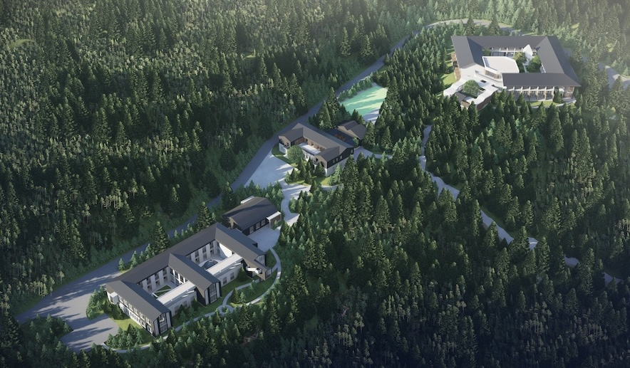

<br>


<center>

</center>

<font size="4">The workshop will be held **June 9-15, 2024**, at **Tianyuan Mathematics Research Center, Kunming, Yunnan Province, China** (http://tianyuan.amss.ac.cn). The workshop is sponsored by Tianyuan Fund for Mathematics.

The workshop will cover a wide range of topics, including but not limited to the classification, regularity, and quantitative property of solutions to nonlinear partial differential equations and systems. </font>

## Confirmed Speakers


```{r echo=FALSE}
library(readxl)
Book2 <- read_excel("Book2.xls", sheet = "Speaker", range="B1:C14")
knitr::kable(Book2, "pipe")
```

## Schedule

TBA

## Location, Travel and Accommodation

Take flight to **Kunming Changshui International Airport**. The research center provides free shuttle service between it and the airport. The Tianyuan Fund will cover the lodging and meals for all the participants.


## Organizing Committee

* [Liming Sun](https://sunliminghome.github.io/) (Chinese Academy of Sciences)

* [Zhi-Qiang Wang](https://www.usu.edu/math/wang/) (Utah State University)
 
* [Zhitao Zhang](http://homepage.amss.ac.cn/research/homePage/eb08df1502d84b57a114ce9ac6e335b6/myHomePage.html) (Chinese Academy of Sciences)